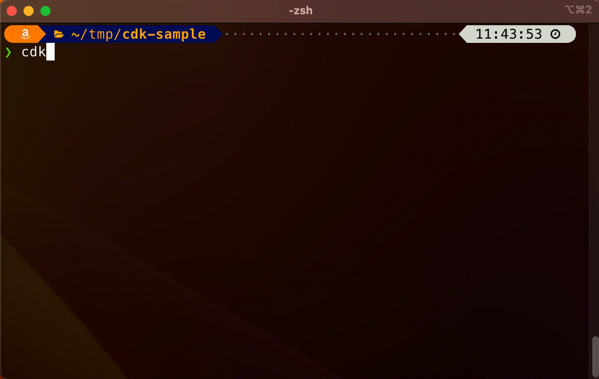

# AWS CDK zsh completion

This is a zsh completion function for AWS CDK.

(日本語の情報 (for Japanese) : https://blog.msysh.me/posts/2023/06/cdk_zsh_completion.html)

## Demo



## Installation

If you use `fpath` in `~/.zshrc`, store [_cdk](./_cdk) file in a directory which is specified by `fpath`. And then reload zsh such as `exec -l $SHELL`.

ex)

If in `~/.zshrc`

```shell
  :
fpath=($fpath ~/.zsh/completion)
  :
```

Let's store [_cdk](./_cdk) file in `~/.zsh/completion`

```shell
mv _cdk ~/.zsh/completion
```

And then

```shell
exec -l $SHELL
```

If it doesn't work, deleting `~/.zcompdump` file may work

## Reference

This topic is discussed at [AWS CDK offical repo](https://github.com/aws/aws-cdk/). I was inspired from it.
https://github.com/aws/aws-cdk/discussions/24380#discussioncomment-5158176

## License

MIT